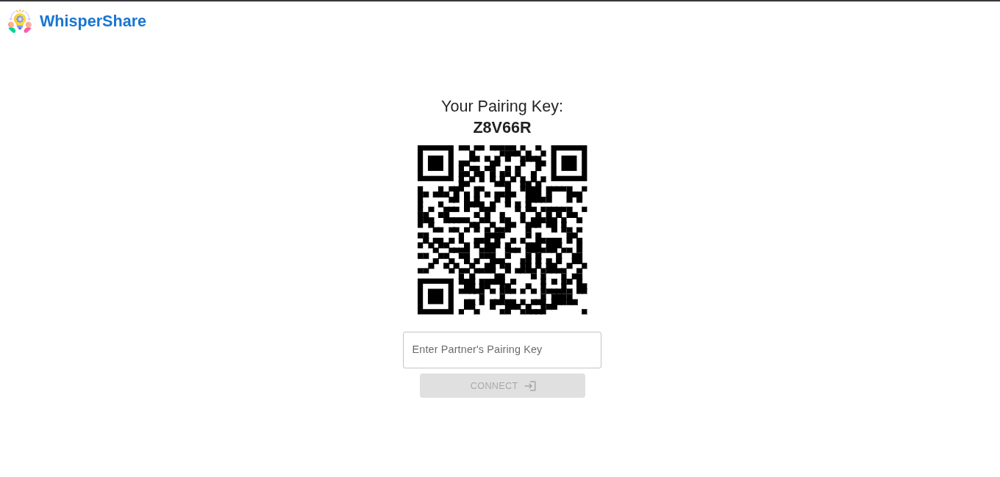
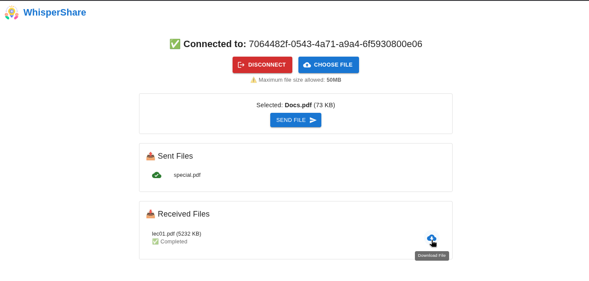

# 🔐 Whisper-Share

**Whisper-Share** is a secure, lightning-fast file-sharing platform built using the **MERN Stack**, with **WebSocket-based real-time communication** and **QR code pairing** to enable one-to-one private file transfer—**no login, no trace, no cloud**. Just scan, pair, and share!

> 📡 Powered by Express.js, React, WebSockets, and MongoDB  
> 🎨 Built with Material UI  
> 🔒 Secret, Peer-to-Peer, and Temporary File Transfer

---

## 🚀 Features

- 📷 **QR Code or Pairing Key Connection**  
- 📁 **Instant File Sharing** (Up to 50MB/file)  
- 🔐 **No login, no data stored on server**  
- 💬 Real-time transfer via **WebSocket**  
- 🧩 Simple & interactive UI with **Material UI**  
- 🧪 Built with **MERN Stack** and **Express WebSocket server**

---

## 🌐 Website

> GitHub Repo: [Whisper-Share](https://github.com/amankrs21/Whisper-Share.git)

**Live Demo:** [https://whisper-share.azurewebsites.net/](https://whisper-share.azurewebsites.net/)

---

## 🛠️ Getting Started

### 1️⃣ Clone the repository
```bash
git clone https://github.com/amankrs21/Whisper-Share.git
cd Whisper-Share
```

### 2️⃣ Frontend Setup (React + MUI)

```bash
cd client
npm install
npm run build
```

### 3️⃣ Backend Setup (Express + WebSocket)

```bash
cd ..
npm install
npm run dev
```

This will start the WebSocket + Express server at `http://localhost:5000`

---

## 🖼️ Screenshots

### 🔗 Pairing Screen


### 📁 Connected Screen (File Transfer)


---

## 👥 Contributors
- Aman Singh - [@amankrs21](https://www.github.com/amankrs21)

---

## 📄 License

This project is licensed under the **Apache License 2.0** - see the [LICENSE](./LICENSE) file for details.

---

## 🙌 Support

If you like this project, drop a ⭐ on the repo. Feel free to fork and enhance it.

Made with ❤️ for privacy-conscious file sharing.